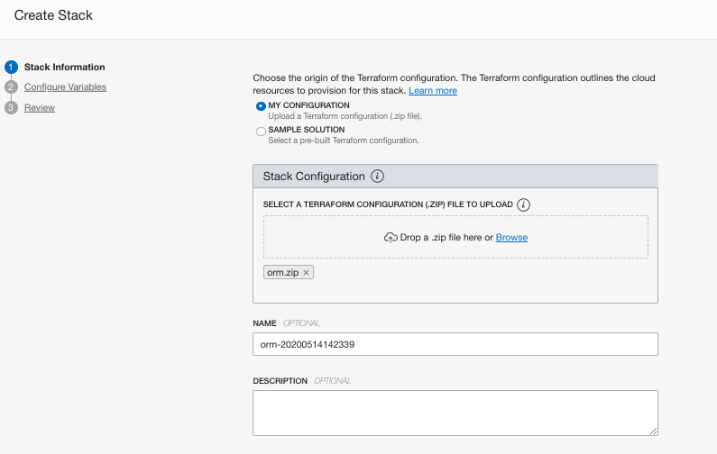

# Provision Data Labeling Service (DLS) Using OCI Resource Manager and Terraform

## Introduction

[](https://cloud.oracle.com/resourcemanager/stacks/create?zipUrl=https://github.com/oracle-quickstart/oci-ods-orm/releases/download/1.0.6/oci-ods-orm-v1.0.6.zip)

This solution allows you to provision [Data Labeling Service (**_DLS_**)](https://docs.oracle.com/en-us/iaas/data-labeling/data-labeling/using/home.htm) and all its related artifacts using [Terraform](https://www.terraform.io/docs/providers/oci/index.html) and [Oracle Cloud Infrastructure Resource Manager](https://docs.cloud.oracle.com/en-us/iaas/Content/ResourceManager/Concepts/resourcemanager.htm).

Below is a list of all artifacts that will be provisioned:

| Component    | Default Name            | Optional |  Notes
|--------------|-------------------------|----------|:-----------|
| [Group](https://docs.cloud.oracle.com/en-us/iaas/Content/Identity/Tasks/managinggroups.htm)        | Oracle Cloud Infrastructure Users Group              | False    | All Policies are granted to this group, you can add users to this group to grant me access to ODS services.
| [Dynamic Group](https://docs.cloud.oracle.com/en-us/iaas/Content/Identity/Tasks/managingdynamicgroups.htm) | Oracle Cloud Infrastructure Dynamic Group           | False    | Dynamic Group for Functions and API Gateway.
| [Policies (compartment)](https://docs.cloud.oracle.com/en-us/iaas/Content/Identity/Concepts/policygetstarted.htm)   | Oracle Cloud Infrastructure Security Policies        | False              | A policy at the compartment level to grant access to ODS, VCN, Functions and API Gateway
| [Policies (root)](https://docs.cloud.oracle.com/en-us/iaas/Content/Identity/Concepts/policygetstarted.htm)    | Oracle Cloud Infrastructure Security Policies        | False              | A policy at the root compartment level to grant access to OCIR in tenancy.

## Prerequisite

- You need a user with an **Administrator** privileges to execute the ORM stack or Terraform scripts.
- Make sure your tenancy has service limits availabilities for the above components in the table.

## Using Resource Manager

1. clone repo `git clone git@github.com:oracle-quickstart/oci-dls.git`
1. Download [`oci-ods-orm-v1.0.6.zip`](../../releases/download/1.0.6/oci-ods-orm-v1.0.6.zip) file ???
1. From Oracle Cloud Infrastructure **Console/Resource Manager**, create a new stack.
1. Make sure you select **My Configurations** and then upload the zip file downloaded in the previous step.
1. Set a name for the stack and click Next.
1. Set the required variables values and then Create.
    

1. From the stack details page, Select **Plan** under **Terraform Actions** menu button and make sure it completes successfully.
    

1. From the stack details page, Select **Apply** under **Terraform Actions** menu button and make sure it completes successfully.
    

1. To destroy all created artifacts, from the stack details page, Select **Destroy** under **Terraform Actions** menu button and make sure it completes successfully.
    

### Understanding Provisioning Options

- **IAM Groups/Policies** change default names of Groups and Policies to be created.

    


    ## Using Terraform

    1. Clone repo

       ```bash
       git clone git@github.com:oracle-quickstart/oci-dls.git
       cd oci-dls/terraform
       ```

    1. Create a copy of the file **oci-dls/terraform/terraform.tfvars.example** in the same directory and name it **terraform.tfvars**.
    1. Open the newly created **oci-dls/terraform/terraform.tfvars** file and edit the following sections:
        - **TF Requirements** : Add your Oracle Cloud Infrastructure user and tenant details:

            ```text
               #*************************************
               #           TF Requirements
               #*************************************

               // Oracle Cloud Infrastructure Region, user "Region Identifier" as documented here https://docs.cloud.oracle.com/en-us/iaas/Content/General/Concepts/regions.htm
               region=""
               // The Compartment OCID to provision artificats within
               compartment_ocid=""
               // Oracle Cloud Infrastructure User OCID, more details can be found at https://docs.cloud.oracle.com/en-us/iaas/Content/API/Concepts/apisigningkey.htm#five
               user_ocid=""
               // Oracle Cloud Infrastructure tenant OCID, more details can be found at https://docs.cloud.oracle.com/en-us/iaas/Content/API/Concepts/apisigningkey.htm#five
               tenancy_ocid=""
               // Path to private key used to create Oracle Cloud Infrastructure "API Key", more details can be found at https://docs.cloud.oracle.com/en-us/iaas/Content/General/Concepts/credentials.htm#two
               private_key_path=""
               // "API Key" fingerprint, more details can be found at https://docs.cloud.oracle.com/en-us/iaas/Content/General/Concepts/credentials.htm#two
               fingerprint=""
            ```

        - **IAM Requirements**: Check default values for IAM artifacts and change them if needed

            ```text
               #*************************************
               #          IAM Specific
               #*************************************

               // ODS IAM Group Name (no spaces)
               ods_group_name= "DataScienceGroup"
               // ODS IAM Dynamic Group Name (no spaces)
               ods_dynamic_group_name= "DataScienceDynamicGroup"
               // ODS IAM Policy Name (no spaces)
               ods_policy_name= "DataSciencePolicies"
               // ODS IAM Root Policy Name (no spaces)
               ods_root_policy_name= "DataScienceRootPolicies"
               // If enabled, the needed OCI policies to manage "OCI Vault service" will be created
               enable_vault_policies= true
            ```

    1. Open file **oci-dls/terraform/provider.tf** and uncomment the (user_id , fingerprint, private_key_path) in the **_two_** providers (**Default Provider** and **Home Provider**)

        ```text
            // Default Provider
            provider "oci" {
              region = var.region
              tenancy_ocid = var.tenancy_ocid
              ###### Uncomment the below if running locally using terraform and not as Oracle Cloud Infrastructure Resource Manager stack #####
            //  user_ocid = var.user_ocid
            //  fingerprint = var.fingerprint
            //  private_key_path = var.private_key_path

            }


            // Home Provider
            provider "oci" {
              alias            = "home"
              region           = lookup(data.oci_identity_regions.home-region.regions[0], "name")
              tenancy_ocid = var.tenancy_ocid
              ###### Uncomment the below if running locally using terraform and not as Oracle Cloud Infrastructure Resource Manager stack #####
            //  user_ocid = var.user_ocid
            //  fingerprint = var.fingerprint
            //  private_key_path = var.private_key_path

            }
        ```

## Resource Manager Deployment

This Quick Start uses [OCI Resource Manager](https://docs.cloud.oracle.com/iaas/Content/ResourceManager/Concepts/resourcemanager.htm) to make deployment easy, sign up for an [OCI account](https://cloud.oracle.com/en_US/tryit) if you don't have one, and just click the button below:

[](https://console.us-ashburn-1.oraclecloud.com/resourcemanager/stacks/create?region=home&zipUrl=https://github.com/oracle-quickstart/oci-quickstart-template/archive/master.zip)

After logging into the console you'll be taken through the same steps described
in the [Deploy](#deploy) section below.


Note, if you use this template to create another repo you'll need to change the link for the button to point at your repo.

## Local Development

First off we'll need to do some pre deploy setup.  That's all detailed [here](https://github.com/oracle/oci-quickstart-prerequisites).

Note, the instructions below build a `.zip` file from you local copy for use in ORM.
If you want to not use ORM and deploy with the terraform CLI you need to rename
`provider.tf.cli -> provider.tf`. This is because authentication works slightly
differently in ORM vs the CLI. This file is ignored by the build process below.

Make sure you have terraform v0.14+ cli installed and accessible from your terminal.

### Build

Simply `build` your package and follow the [Resource Manager instructions](https://docs.cloud.oracle.com/en-us/iaas/Content/ResourceManager/Tasks/managingstacksandjobs.htm#console) for how to create a stack.  Prior to building the Stack, you may want to modify some parts of the deployment detailed below.

In order to `build` the zip file with the latest changes you made to this code, you can simply go to [build-orm](./build-orm) folder and use terraform to generate a new zip file:

At first time, you are required to initialize the terraform modules used by the template with  `terraform init` command:

```bash
$ terraform init

Initializing the backend...

Initializing provider plugins...
- Finding latest version of hashicorp/archive...
- Installing hashicorp/archive v2.1.0...
- Installed hashicorp/archive v2.1.0 (signed by HashiCorp)

Terraform has created a lock file .terraform.lock.hcl to record the provider
selections it made above. Include this file in your version control repository
so that Terraform can guarantee to make the same selections by default when
you run "terraform init" in the future.

Terraform has been successfully initialized!

You may now begin working with Terraform. Try running "terraform plan" to see
any changes that are required for your infrastructure. All Terraform commands
should now work.

If you ever set or change modules or backend configuration for Terraform,
rerun this command to reinitialize your working directory. If you forget, other
commands will detect it and remind you to do so if necessary.
```

Once terraform is initialized, just run `terraform apply` to generate ORM zip file.

```bash
$ terraform apply

data.archive_file.generate_zip: Refreshing state...

Apply complete! Resources: 0 added, 0 changed, 0 destroyed.
```

This command will package the content of `simple` folder into a zip and will store it in the `build-orm\dist` folder. You can check the content of the file by running `unzip -l dist/orm.zip`:

```bash
$ unzip -l dist/orm.zip
Archive:  dist/orm.zip
  Length      Date    Time    Name
---------  ---------- -----   ----
     1140  01-01-2049 00:00   compute.tf
      680  01-01-2049 00:00   data_sources.tf
     1632  01-01-2049 00:00   image_subscription.tf
     1359  01-01-2049 00:00   locals.tf
    13548  01-01-2049 00:00   marketplace.yaml
     2001  01-01-2049 00:00   network.tf
     2478  01-01-2049 00:00   nsg.tf
      830  01-01-2049 00:00   oci_images.tf
     1092  01-01-2049 00:00   outputs.tf
       44  01-01-2049 00:00   scripts/example.sh
     4848  01-01-2049 00:00   variables.tf
      311  01-01-2049 00:00   versions.tf
---------                     -------
    29963                     12 files
```

### Deploy

1. [Login](https://console.us-ashburn-1.oraclecloud.com/resourcemanager/stacks/create) to Oracle Cloud Infrastructure to import the stack
    > `Home > Solutions & Platform > Resource Manager > Stacks > Create Stack`

2. Upload the `orm.zip` and provide a name and description for the stack


3. Configure the Stack. The UI will present the variables to the user dynamically, based on their selections. These are the configuration options:


4. Click Next and Review the configuration.
5. Click Create button to confirm and create your ORM Stack.
6. On Stack Details page, you can now run `Terraform` commands to manage your infrastructure. You typically start with a plan then run apply to create and make changes to the infrastructure. More details below:

|      TERRAFORM ACTIONS     |           DESCRIPTION                                                 |
|----------------------------|-----------------------------------------------------------------------|
|Plan                        | `terraform plan` is used to create an execution plan. This command is a convenient way to check the execution plan prior to make any changes to the infrastructure resources.|
|Apply                       | `terraform apply` is used to apply the changes required to reach the desired state of the configuration described by the template.|
|Destroy                     | `terraform destroy` is used to destroy the Terraform-managed infrastructure.|

## Contributing

`oci-dls` is an open source project. See [CONTRIBUTING](CONTRIBUTING.md) for details.

Oracle gratefully acknowledges the contributions to `oci-dls` that have been made by the community.
